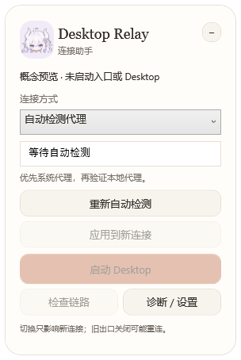

# Desktop Relay

一个 Windows 小型代理转发与启动工具，为 ChatGPT / Codex Desktop 提供固定的本地代理入口，自动发现本地代理，并方便在不同 VPN、v2rayN 或本地 HTTP 代理之间切换。

**实验性工具。已通过本地协议与回归测试，尚未完成真实 Desktop 账号的完整验收。它不保证所有内部网络实现都遵循默认代理，也不保证运行中的任务无缝切换。**


## 为什么制作这个工具

这个项目起于 Windows Desktop 偶发显示 `Reconnecting 1/5～5/5`，随后自动恢复，而网页版正常的排查。机器上会切换多个代理：例如一个使用本地端口 `6134`，另一个使用 `7892`。

最初用启动脚本读取当前系统代理并设置 Desktop 的环境变量。这解决了启动时继承旧代理地址的一部分问题，但进程启动后仍固定使用当时的地址；换 VPN 后，旧端口可能不再可用。只设置 `HTTP_PROXY` / `HTTPS_PROXY` 也不足以覆盖 Desktop 中的 Chromium 和 Node 默认网络实现。

于是制作了这个小挂件：Desktop 默认代理连接到一个稳定的本地入口，挂件选择入口背后的出口。既提供启动按钮，也保留足够的诊断信息，减少反复编辑脚本和猜测连接失败原因的需要。

## 修正了什么

- **启动时的代理设置不完整**：同时传入 Chromium 的 `--proxy-server`、本地回环绕过列表，以及 Node 的 `NODE_USE_ENV_PROXY=1`；后端仍获得 `HTTP_PROXY` / `HTTPS_PROXY`。仅修改本次子进程的环境，不写永久环境变量。
- **切换代理与启动地址耦合**：使用固定本地入口，手动更改新连接的上游出口；不把 Desktop 固定到某两个 VPN 的端口。
- **检测结果不能代表转发链路**：HTTPS 检测通过 Relay 入口发送，避免绕过 Relay 直接检测上游造成误判。
- **系统代理关闭时无法发现本地代理**：自动发现已识别代理进程的监听端口，验证后再选择；没有候选时回退到手动配置。
- **展开后收起位置偏移**：胶囊坐标独立保存，展开时的屏幕边界校正不再覆盖它。
- **未应用出口误报网络失败**：明确区分前置状态、HTTPS 超时和真实连接异常，补充内部错误。
- **退出后无法追查失败**：将脱敏诊断保存到磁盘，记录连接编号、目标域名/端口、路由代数、阶段、耗时、上游 CONNECT 状态和套接字错误。

这些修正解决的是工具的启动配置、转发与诊断缺陷。**没有证据证明原始 `Reconnecting` 的所有情况都由代理端口造成，也不声称消除了 Desktop 自身的 WebSocket、DNS 或连接池问题。**

## 使用

需要 Windows 和 .NET 8 Windows Desktop Runtime。可从仓库的 Releases 获取便携包；也可以按下面的步骤自行构建。

1. 解压到可写目录，运行 `DesktopRelay.exe`，保持同目录的文件完整。
2. 启动后默认自动检测：先验证系统静态代理，再发现并验证本地代理。只有一个候选有 HTTPS 响应时自动应用；多个候选让你选择；都失败时再填写自定义 HTTP 代理或选择直连 / TUN。
3. 手动选择或更改出口后点击“应用到新连接”，再点击“检查链路”。收到 HTTP 响应说明 HTTPS 链路收到回复；`401`、`403` 不表示账号功能已验证。
4. 等当前任务结束后完整退出已有 Desktop，再由挂件点击“启动 Desktop”。已经运行的进程不会被强制关闭，也不能补加新启动参数。
5. 之后可保持 Desktop 打开，选择新出口并应用。新建连接使用新出口，已有隧道和连接池仍可能使用旧出口。

“直连 / TUN”只在系统直连可用或已开启 TUN 时使用。本工具不启动 VPN、不开启 TUN，也不改变系统路由。远端 VLESS 服务器的 `443` 端口不是本地 HTTP 代理入口。

关闭旧 VPN 可能使已有连接断开；任务能否恢复由 Desktop 决定。退出挂件会停止它承载的转发。不要在任务进行中为了立即切换而关闭旧出口或挂件。



## 支持与限制

- 当前系统静态 HTTP 代理、自定义 HTTP/混合代理、直连或已有 TUN。
- 不支持上游 SOCKS、PAC、代理认证或多个 HTTP/HTTPS 上游同时配置。
- 只监听 IPv4 回环地址，不提供局域网代理。
- 已有连接保留旧路由；连接池可能延迟采用新出口。
- 某些 Desktop 连接器有自己的代理/连接选项，可能覆盖默认行为；启动参数不是系统级流量接管。
- 通过当前用户的安装清单查找 `OpenAI.Codex`，不固定某个安装版本目录。应用未来若更改包名、入口或运行时能力，需要重新验证。
- 界面可拖动、折叠为长条、隐藏到托盘；头像是界面素材，没有独立桌宠窗口。
- 本项目是非官方工具，与 OpenAI 没有隶属或背书关系。

## 构建与验证

安装 .NET 8 SDK 后：

```powershell
dotnet publish src/App/DesktopRelay.App.csproj -c Release -r win-x64 --self-contained false -o app
dotnet run --project src/Tests/DesktopRelay.Tests.csproj -c Release
```

Windows 集成测试另需 Node 24.5 或更新版本：

```powershell
$env:RELAY_TEST_NODE = (Get-Command node).Source
dotnet run --project src/WindowsTests/DesktopRelay.WindowsTests.csproj -c Release -- --offline
```

本地回归确认：旧配置下 Node 请求没有进入代理；启用环境代理后，HTTPS `200` 和 WebSocket 升级握手 `101` 经过 Relay。测试还覆盖运行中改出口时保留旧隧道、上游拒绝、超时、递归保护、请求体、日志轮转。见 [验证范围](docs/testing.md) 和 [工作原理](docs/architecture.md)。

## 诊断和隐私

日志位于应用目录的 `relay-diagnostics.log`，达到约 1 MiB 后轮转，保留上一份。它记录域名和端口，但不记录请求路径、正文、令牌或 Cookie。分享日志前请自行检查其中的本机信息。

`settings.json` 保存固定入口端口、当前方式、自定义代理地址和窗口位置。配置与运行日志不在公开仓库中。本机历史资料和构建产物也不会提交。

## 调研线索

项目最初参考了 [openai/codex #29958](https://github.com/openai/codex/issues/29958)、[#36059](https://github.com/openai/codex/issues/36059)、[#48653](https://github.com/openai/codex/issues/48653)。这些是排查线索，不代表它们与此机器上的故障具有相同根因。

## 许可

代码采用 MIT 许可。品牌标志和第三方素材的权利不因本仓库许可而转移。

### 本地代理发现与检测提示

“重新自动检测”会识别 Flyingbird、Cloud Fox、v2ray/xray、sing-box、Clash/mihomo 进程的 IPv4 监听端口（含 0.0.0.0）。监听端口只是候选，不保证为 HTTP，因此会先验证 HTTPS 响应。手动选择后仍可通过“检查链路”验证完整 Relay 入口。其他软件、IPv6、PAC 和 TUN 不在此发现范围，可手动配置。系统代理关闭与本地代理运行是两个不同状态。

未应用出口时不会执行检测，会明确提示；检测异常记录消息及内部异常，超时单独显示。切换只影响新连接。

### 自动检测与位置恢复

启动默认自动检测：优先验证 Windows 静态 HTTP 代理，不可用时验证本地代理候选。单个候选收到 HTTPS HTTP 响应时自动应用；多个候选让用户选择；全部失败才提示自定义 HTTP 或直连/TUN。探测与活动 Relay 分离，不为了试候选而切换现有出口。403 只代表 HTTPS 有响应，不保证账号或 WebSocket 可用。自动发现仍限于已识别进程的 IPv4 监听端口。

从胶囊展开时独立记录胶囊坐标，展开面板可因屏幕边界移动，收起后恢复胶囊坐标，再按当前屏幕工作区校正。
