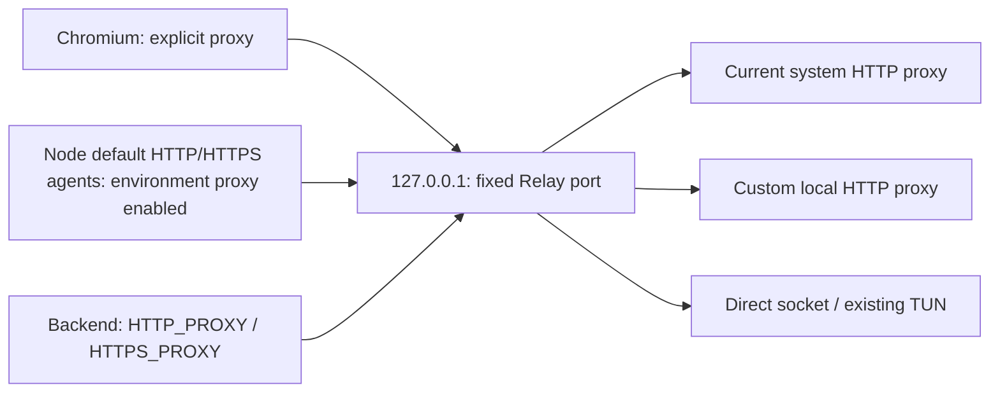

# 工作原理

每个连接接受时取得当前路由和代数快照。用户点击应用后，只有新接受的连接取新路由。已有 CONNECT 隧道不迁移、不强制断开；连接池复用旧隧道时也继续走旧出口。

HTTPS 通过 CONNECT 建立 TCP 隧道，随后透明转发加密字节。Relay 不解密 TLS，不检查聊天正文，因此不能单凭隧道日志确定 TLS 或 WebSocket 应用层关闭的原因；须与 Desktop 日志对应。

普通 HTTP 支持绝对 URL、固定长度和分块请求体，清理逐跳头。入口默认禁用；合法出口应用前请求返回 503。上游连接/握手失败返回 502，拒绝状态写入诊断；已提交隧道时不再注入 HTTP 错误。

入口端口保存在本地配置中；未配置时首次选取空闲端口并保存。失败时不默默换端口，否则已启动的 Desktop 会仍指向旧入口。

当前实现有 16 KiB 请求头限制、128 个并发连接上限和 10 秒初始握手期限。已建立的流没有总时长限制。这些限制是实现边界，尚无证据证明它们是最初重连问题的根因。

程序只更改它启动的子进程环境和参数。它不修改 Windows 系统代理、DNS、VPN 配置或 Desktop 安装文件，不接管使用自定义连接器或独立代理策略的所有流量。
